# DarkArk
[中文说明][url-docen]

DarkArk is a Windows Anti-Rootkit (ARK) tool, tested successfully on Windows 10 and Windows 11. Currently, the project is in the **early development stage**.

[Download DarkArk](https://github.com/baiyies/DarkArk/releases)

# Disclaimer
This project is intended strictly for personal learning and research purposes; please do not use it for any commercial activities. You must comply with local laws and regulations when using it, and it must not be used for malicious purposes. Meanwhile, the author assumes no responsibility for any BSOD, data loss, or other potential issues caused by using DarkArk.
Unless you have fully read, completely understood, and accepted all terms of this agreement, please do not install or use this tool. Your use of the tool, or your acceptance of this agreement in any other express or implied manner, shall be deemed as you having read and agreed to be bound by this agreement.

# Features
Some implemented features are as follows:
- Process Enumeration, Driver Enumeration, Dispatch Function Query, System Threads, System Callbacks, MiniFilter, SSDT, Shadow SSDT, Driver Traces, System Monitoring, Anti-screenshot / Anti-anti-screenshot, Handle Elevate...

# Screenshots
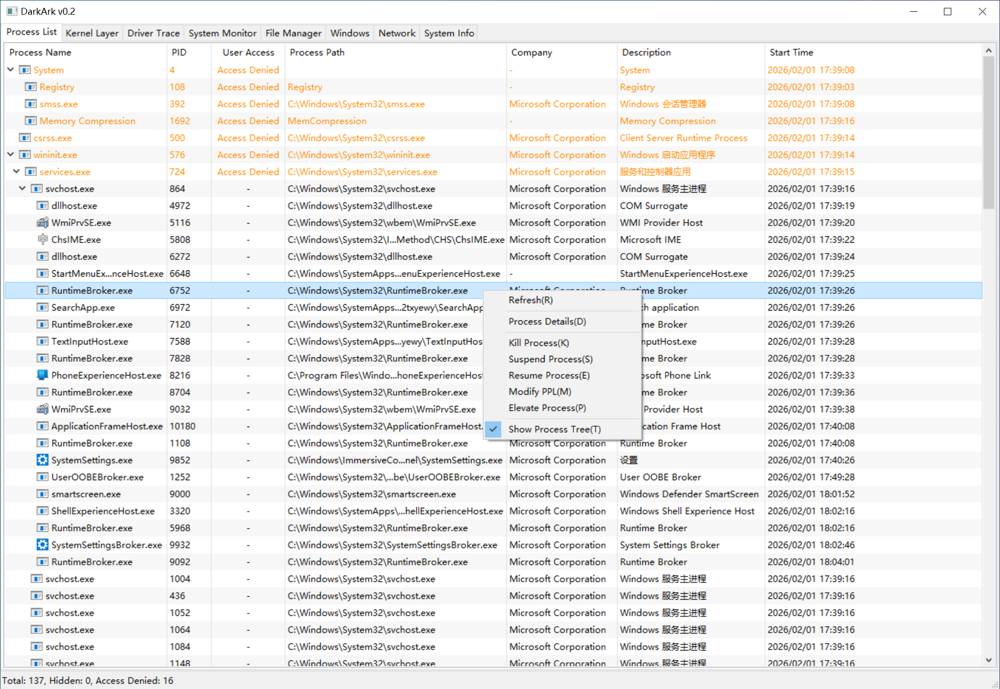
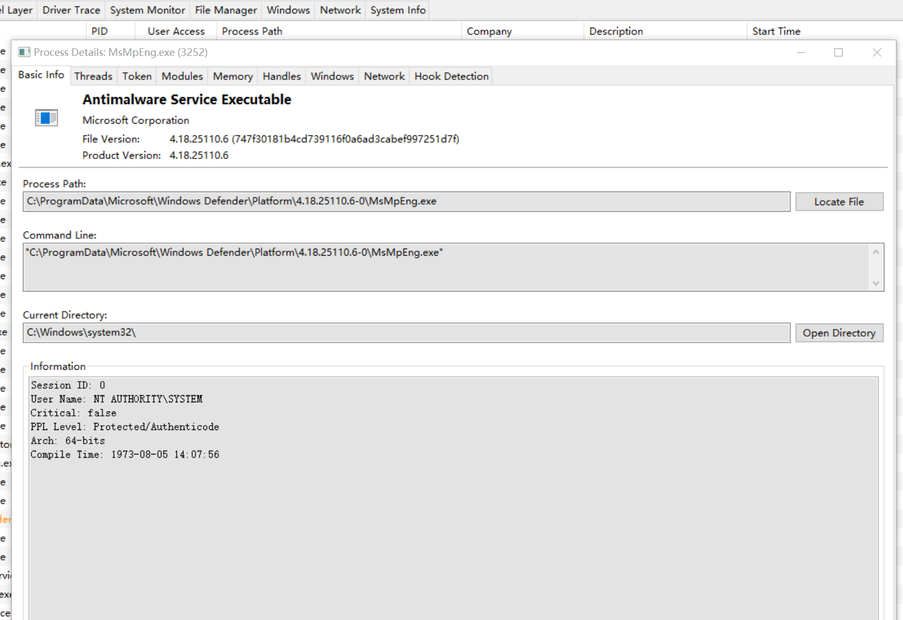
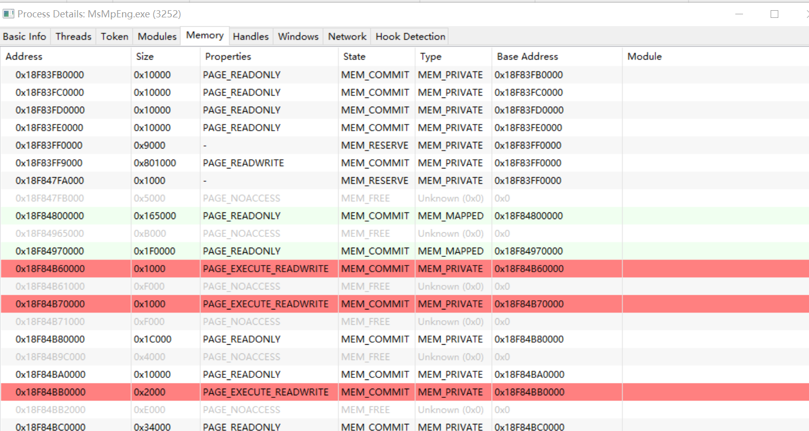
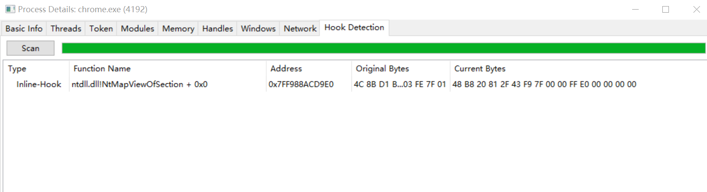
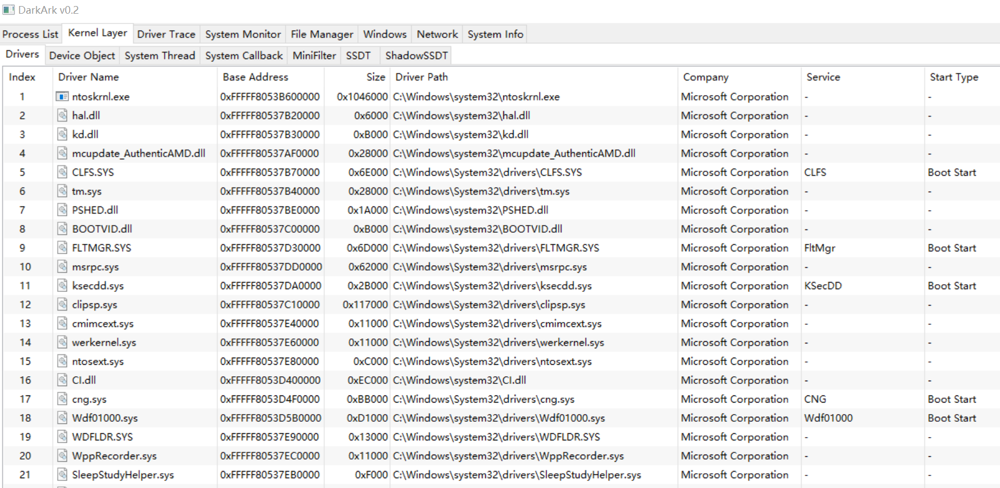
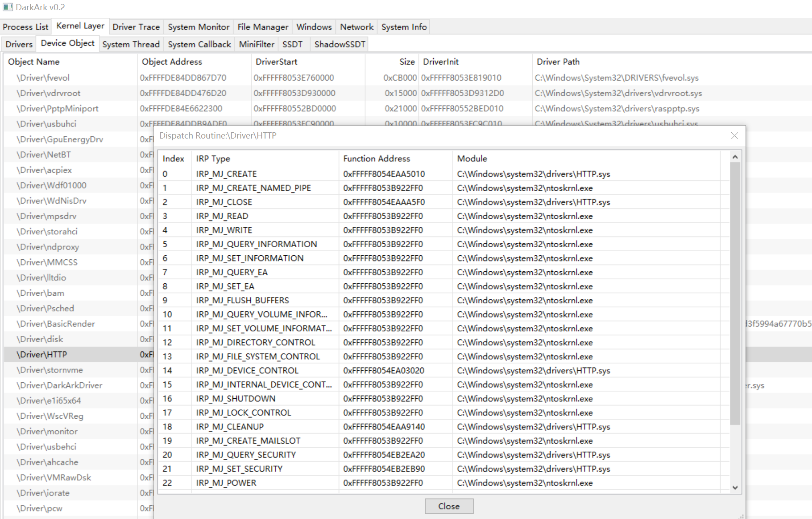
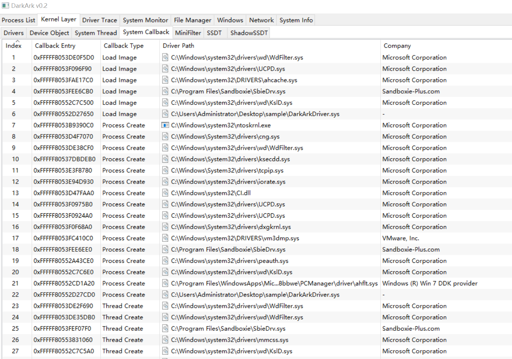
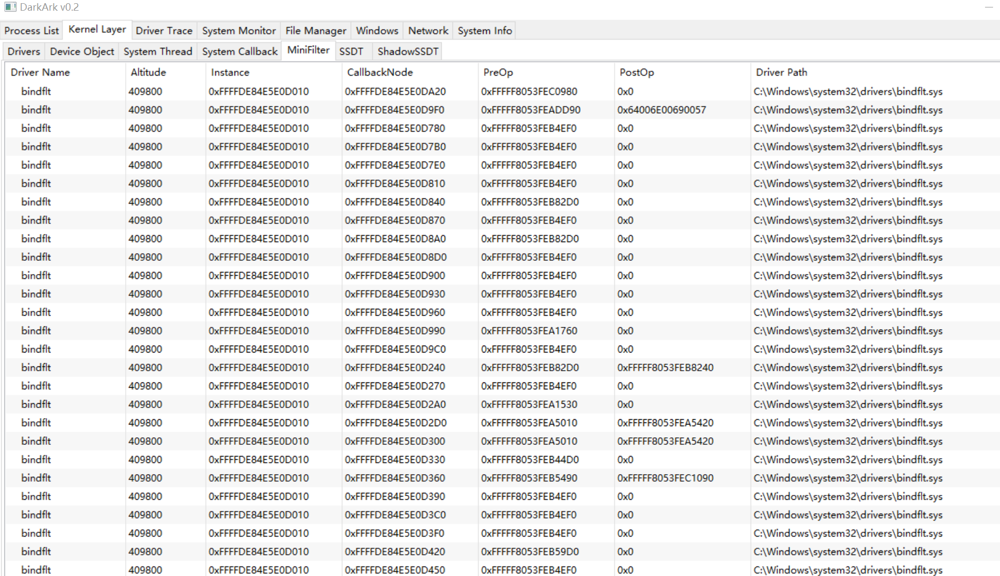
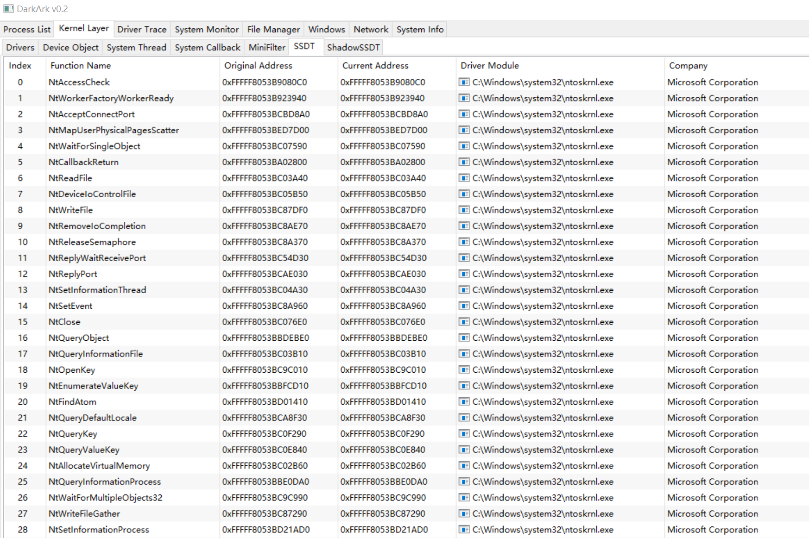
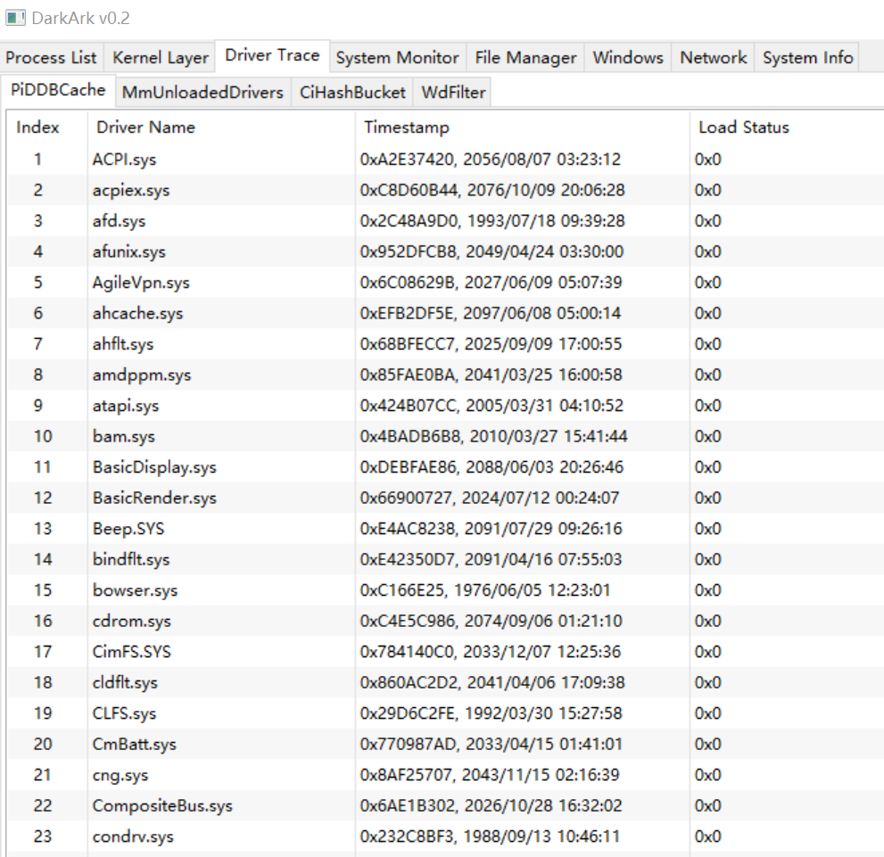
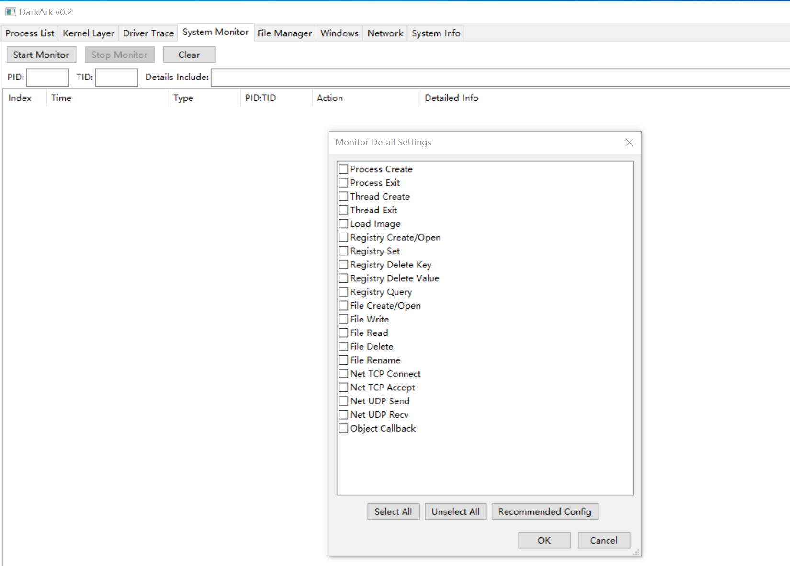
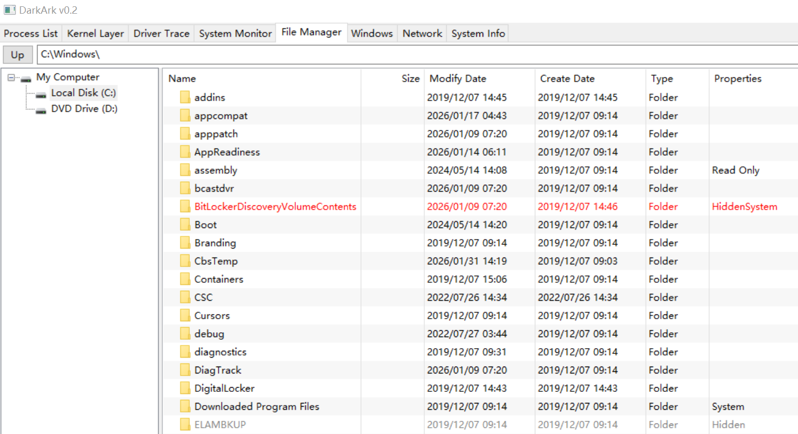

# Update Log
v0.1
Initial release

v0.2
Added English translation, Optimized some details

v0.3
Added Window Finder
Added Anti-screenshot / Anti-anti-screenshot
Added Handle Elevate
Added ETW-TI Monitoring

[url-docen]: README_CN.md
