# DarkArk
[中文说明][url-docen]

DarkArk is a Windows Anti-Rootkit (ARK) tool, tested successfully on Windows 10 and Windows 11. Currently, the project is in the **early development stage**.

[Download DarkArk](https://github.com/baiyies/DarkArk/releases)

# Disclaimer
This project is intended strictly for personal learning and research purposes; please do not use it for any commercial activities. You must comply with local laws and regulations when using it, and it must not be used for malicious purposes. Meanwhile, the author assumes no responsibility for any BSOD, data loss, or other potential issues caused by using DarkArk.
Unless you have fully read, completely understood, and accepted all terms of this agreement, please do not install or use this tool. Your use of the tool, or your acceptance of this agreement in any other express or implied manner, shall be deemed as you having read and agreed to be bound by this agreement.

# Features
Some implemented features are as follows:
- Process Enumeration, Driver Enumeration, Dispatch Function Query, System Threads, System Callbacks, MiniFilter, SSDT, Shadow SSDT, Driver Traces, System Monitoring, ETW-TI, Anti-screenshot / Anti-anti-screenshot, Handle Elevate, DLL injection, Shellcode injection, EXE/DLL/SYS Block, Directory Protection, Manual Map Driver...
- Now supports automated tool calling via MCP

# Screenshots
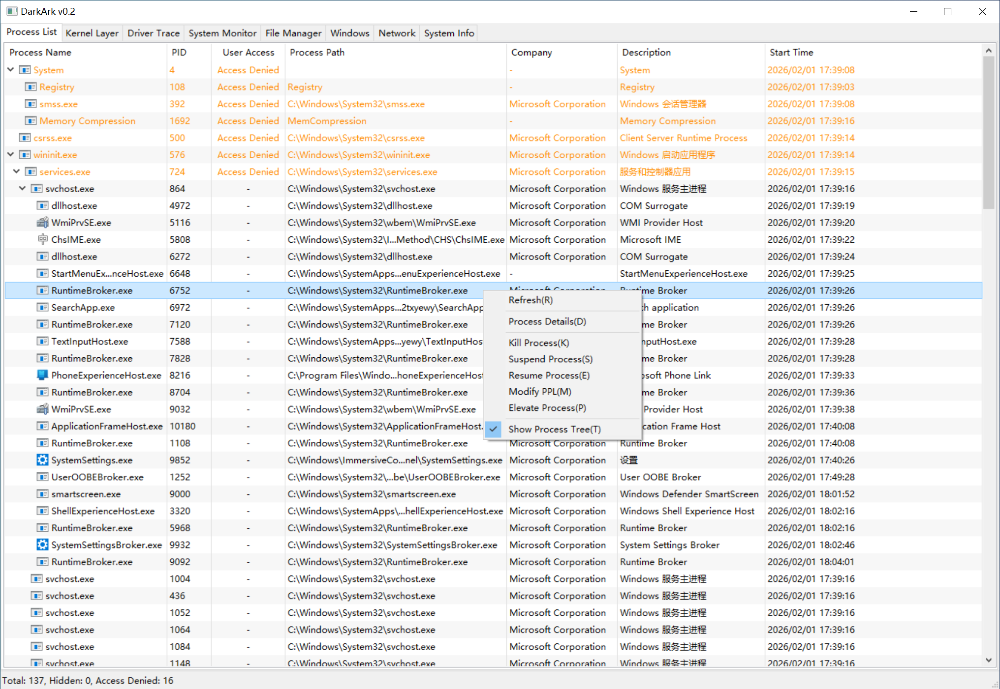
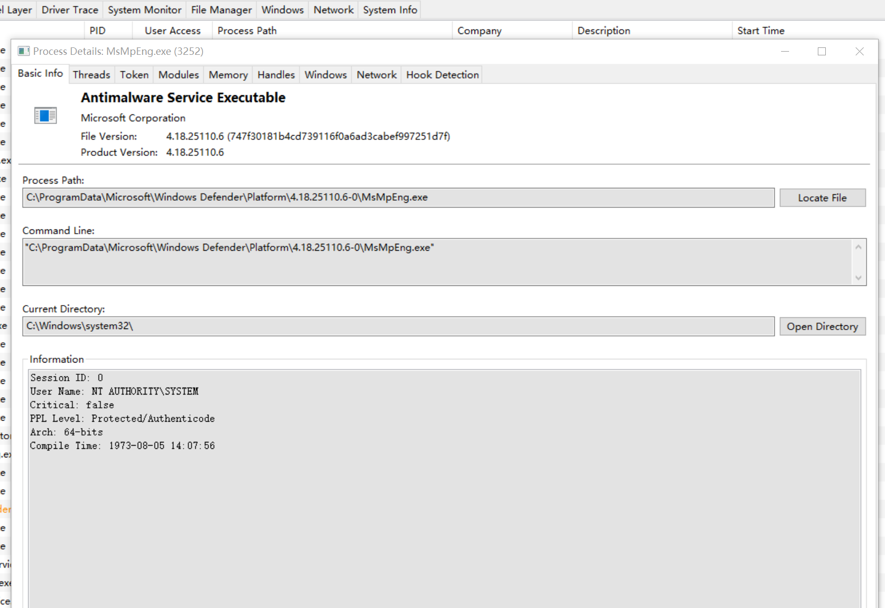
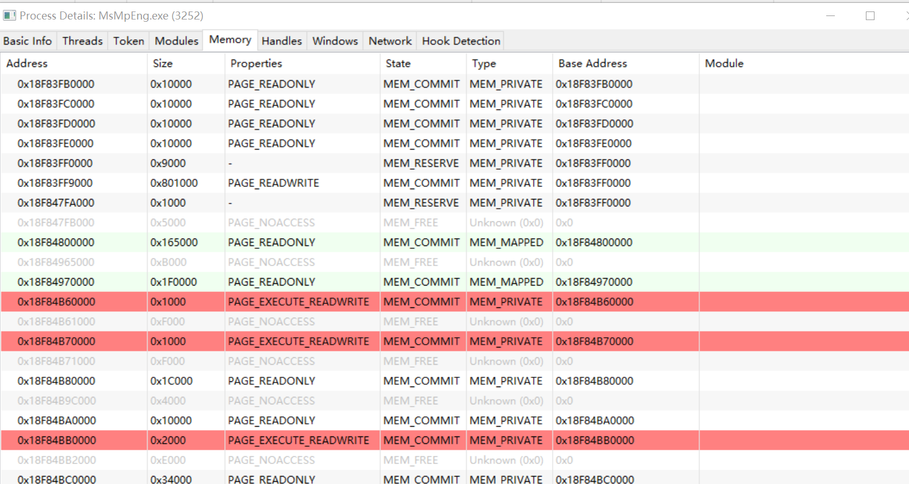
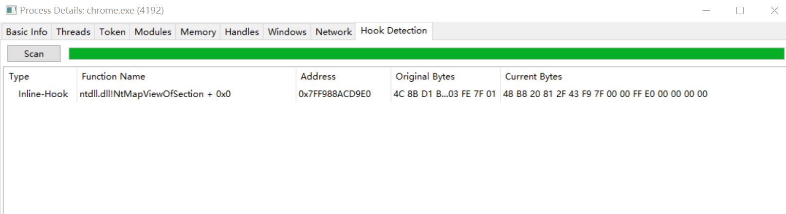
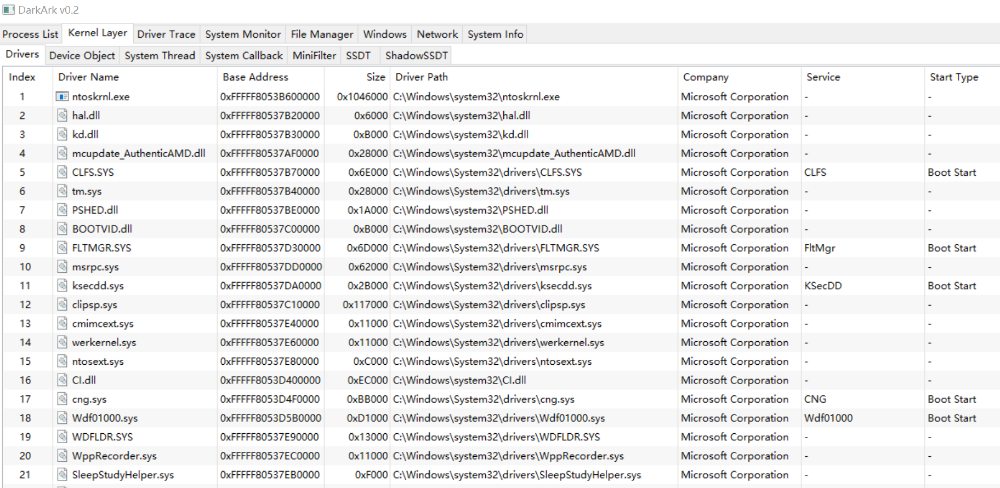
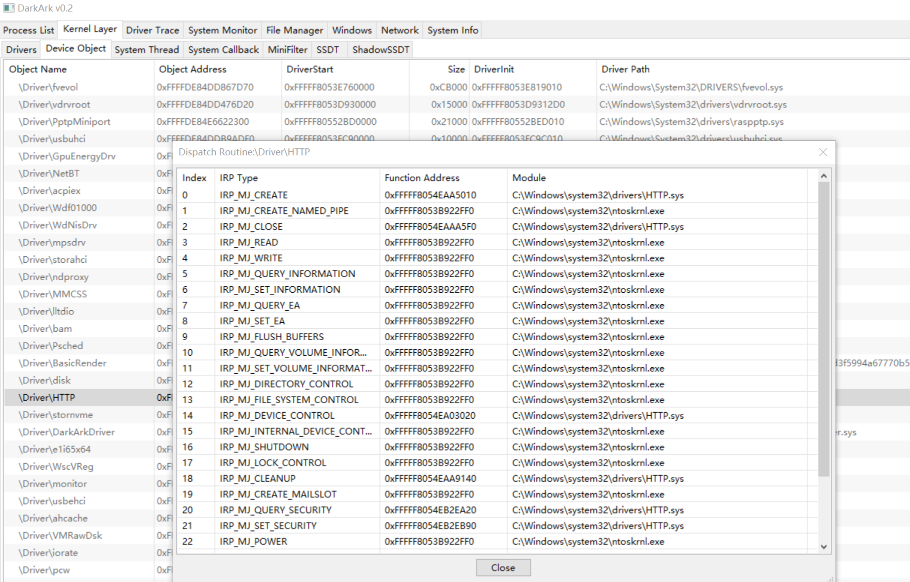
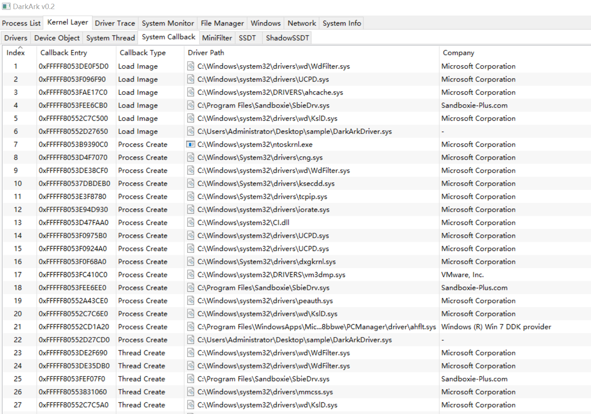
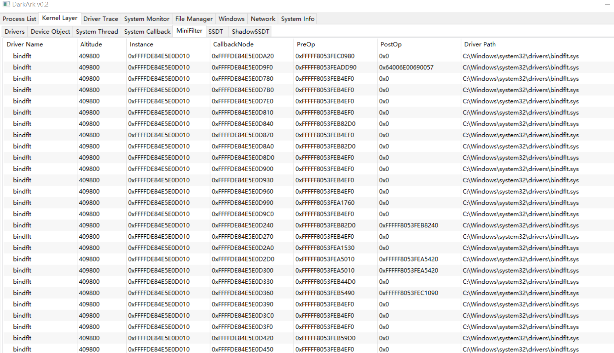
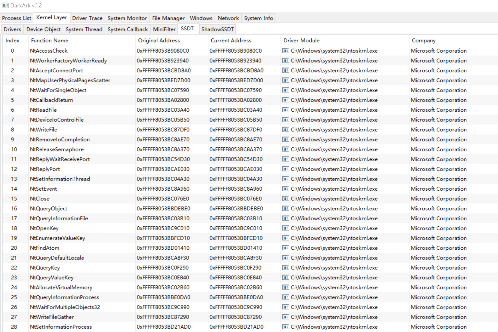
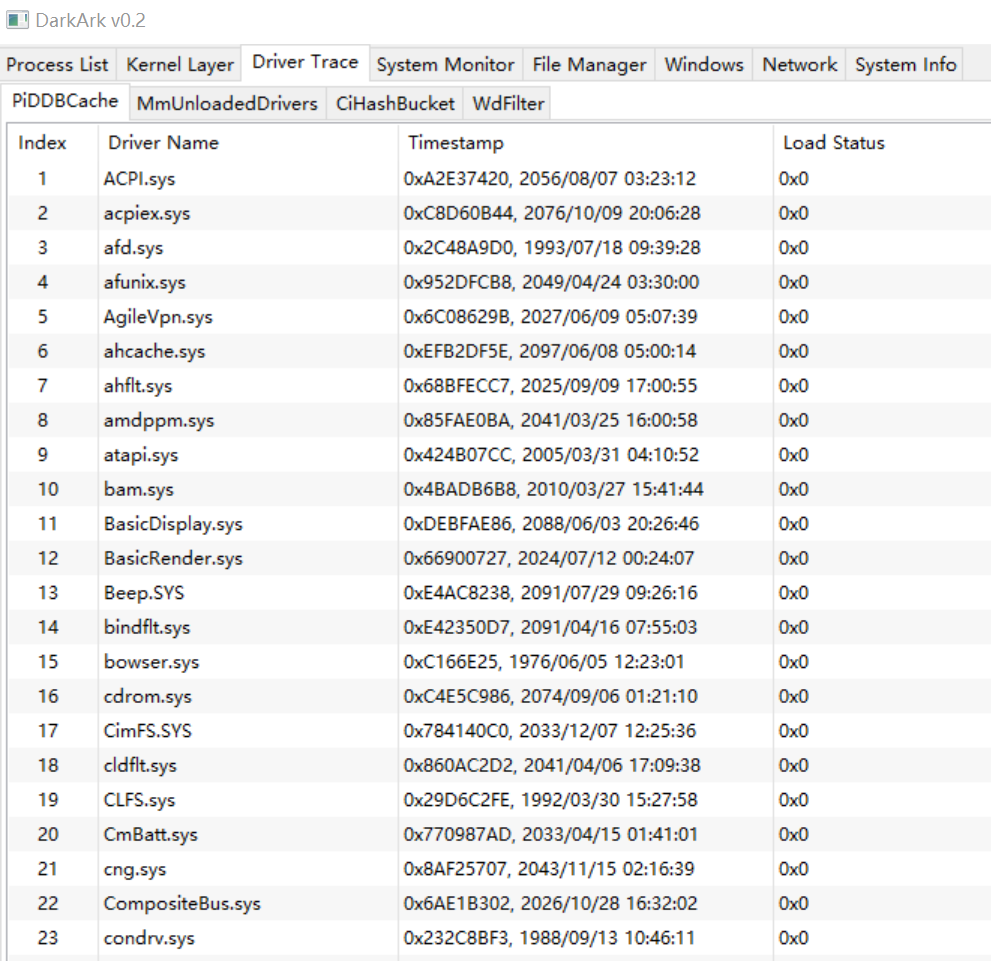
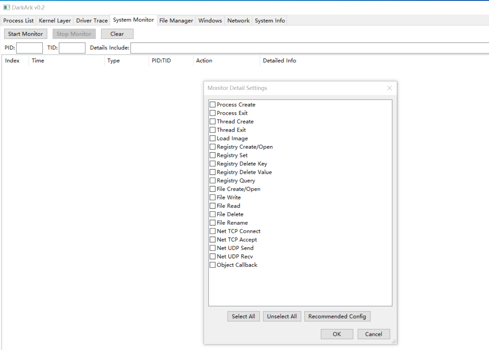
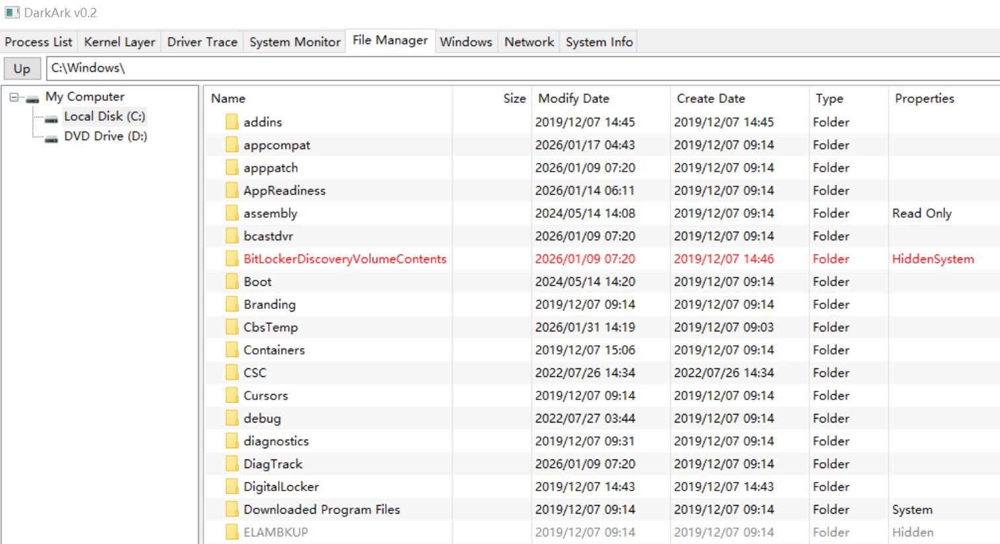

# Changelog
v1.2
- Added automated AI MCP tool calling
- Added support for HVCI

v1.1
- Fixed 32-bit process module enumeration issues
- Optimized file manager performance
- Refined Inline Hook and IAT Hook detection logic
- Improved ETW-TI UI interactions
- Added file unlocking
- Added startup item management
- Added DSE Patch
- Added global disabling for Notify callbacks
- Added WFP Callout / WFP Filter / Hosts management
- Added ETW Hook detection

v1.0
- Major update: overhauled core features and refreshed the UI
- Added Registry browser
- Added system thread suspension, resumption, and termination
- Added process operations: DLL injection, Shellcode injection, and DLL unloading
- Added load interception for specified EXE/DLL/SYS files
- Added directory protection
- Added vulnerable driver disabling
- Added driver manual mapping
- Added KDMapper-dumper
- Optimized MiniFilter information display

v0.4
- Added driver trace cleaning
- Added enable, disable, and remove options for callbacks
- Added disassembly viewer
- Fixed known bugs

v0.3
- Added window finder
- Added anti-screenshot and anti-anti-screenshot
- Added handle extraction
- Added ETW-TI monitoring

v0.2
- Added English translation
- Minor optimizations and polish

v0.1
- Initial release

[url-docen]: README_CN.md
