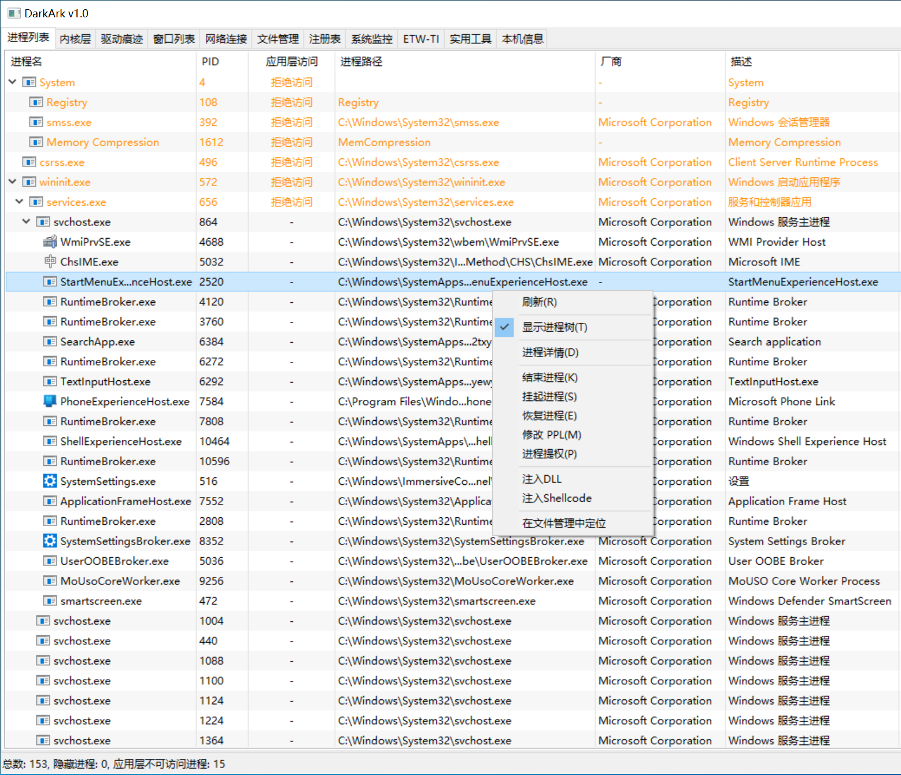
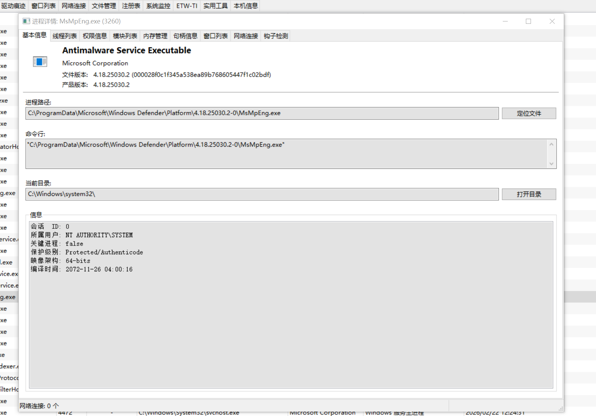
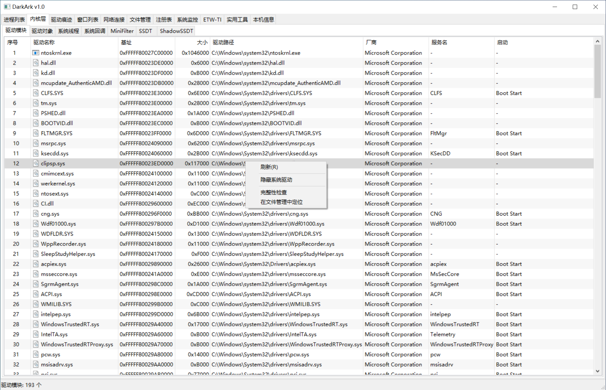
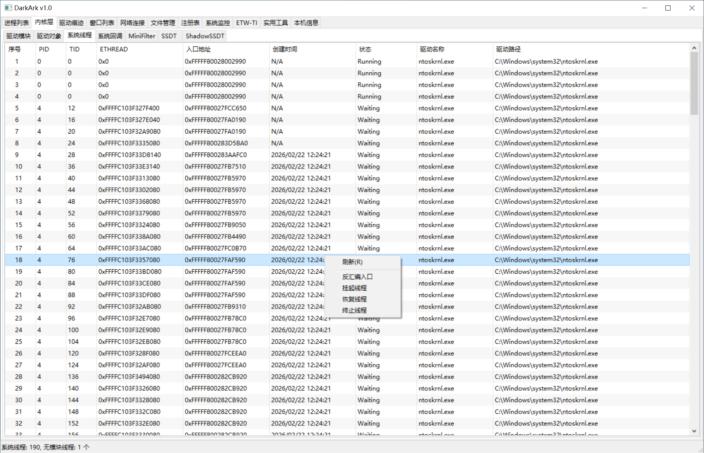
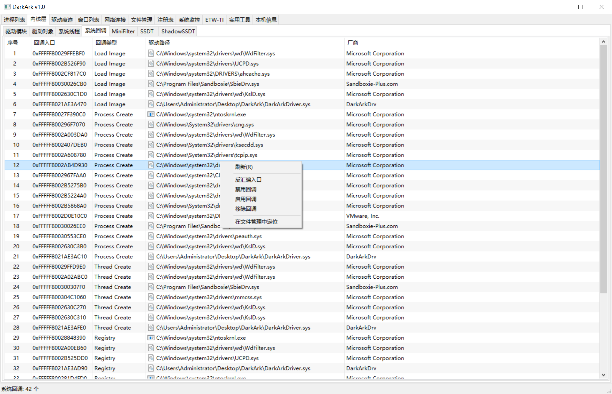
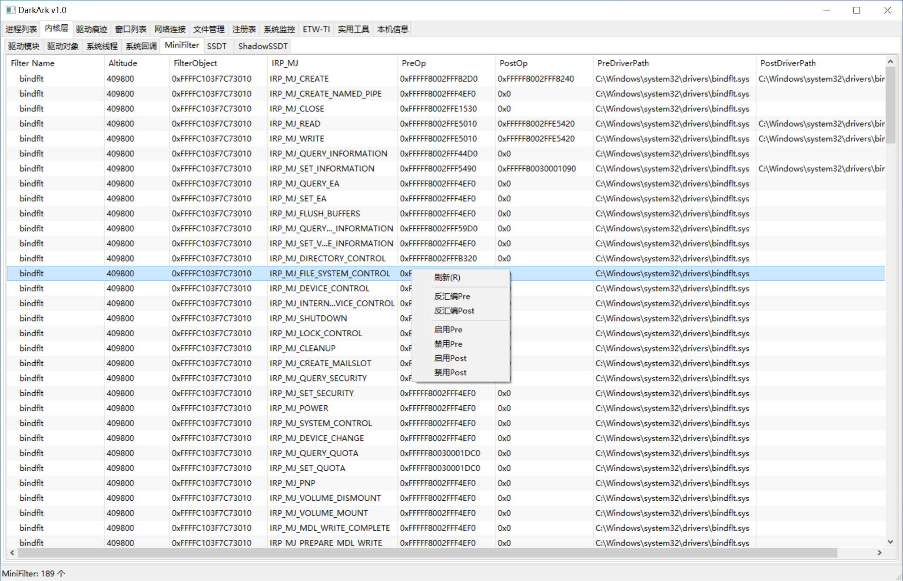
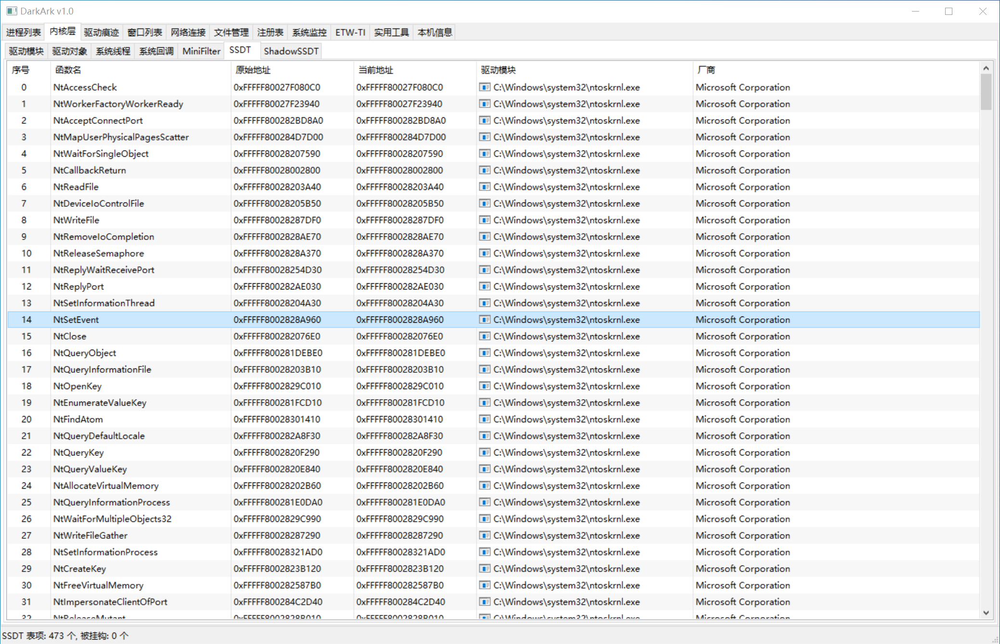
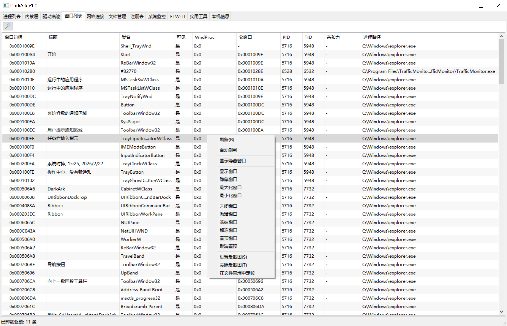
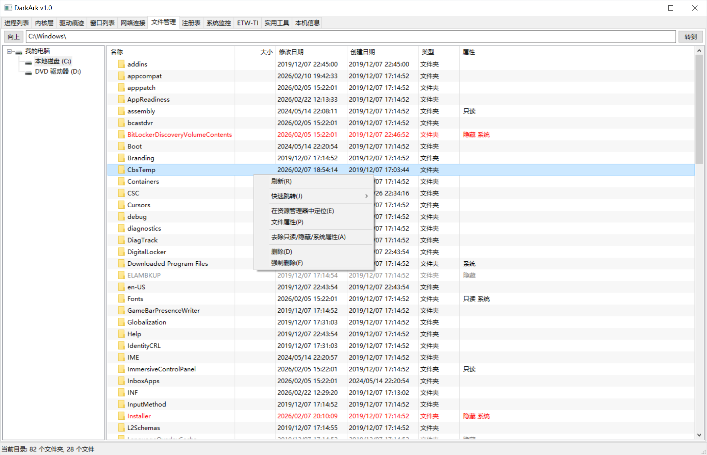
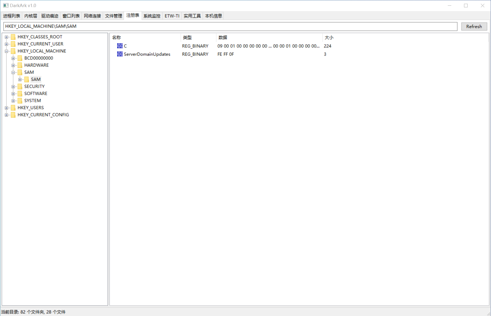

# DarkArk
DarkArk是一款Windows Anti-Rootkit(ARK)工具，已在win10 win11上测试成功。目前项目处于**早期开发阶段**。

[下载DarkArk](https://github.com/baiyies/DarkArk/releases)

# 免责声明
本项目只限个人学习研究使用，请勿用于任何商业用途。在使用时必须遵守当地法律法规，不得用于恶意用途。同时在使用DarkArk时对于可能造成的任何蓝屏或数据损失等作者不承担任何责任。
除非您已充分阅读、完全理解并接受本协议所有条款，否则，请您不要安装并使用本工具。您的使用行为或者您以其他任何明示或者默示方式表示接受本协议的，即视为您已阅读并同意本协议的约束。

# 功能列表
部分已实现功能如下
- 进程枚举 驱动枚举 派遣函数查询 系统线程 系统回调 MiniFilter SSDT Shadow SSDT 驱动痕迹 系统监控 ETW-TI 反截图/反反截图 句柄提权...

# 运行截图

# 更新日志
v0.1
- 初始化

v0.2
- 增加英文翻译
- 优化一些细节

v0.3
- 新增窗口查找
- 新增反截图/反反截图
- 新增句柄提取
- 新增ETW-TI监控

v0.4
- 新增驱动痕迹清除
- 新增启用/禁用/移除 回调
- 新增反汇编浏览视图
- 修复已知bug
